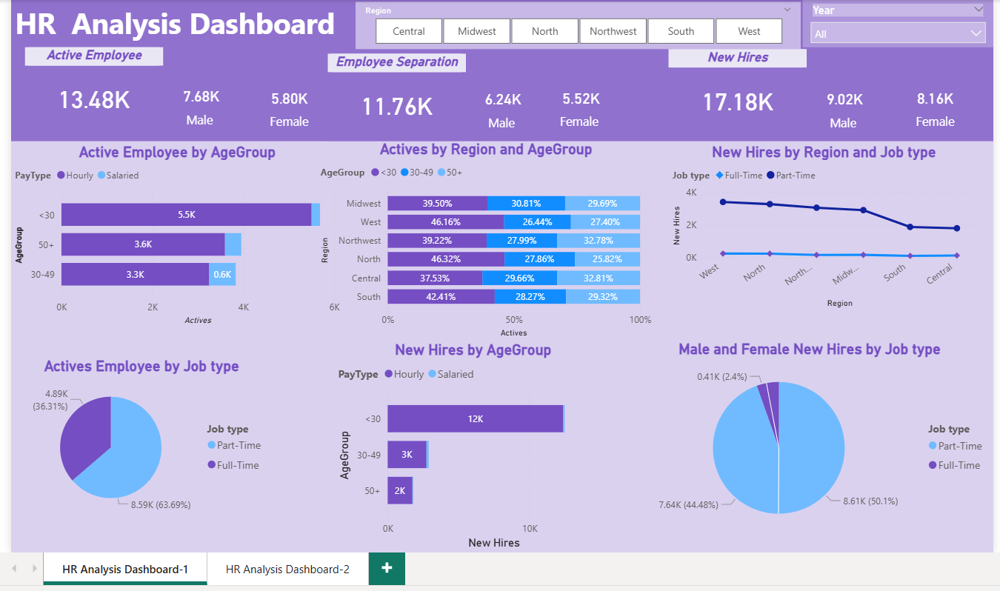
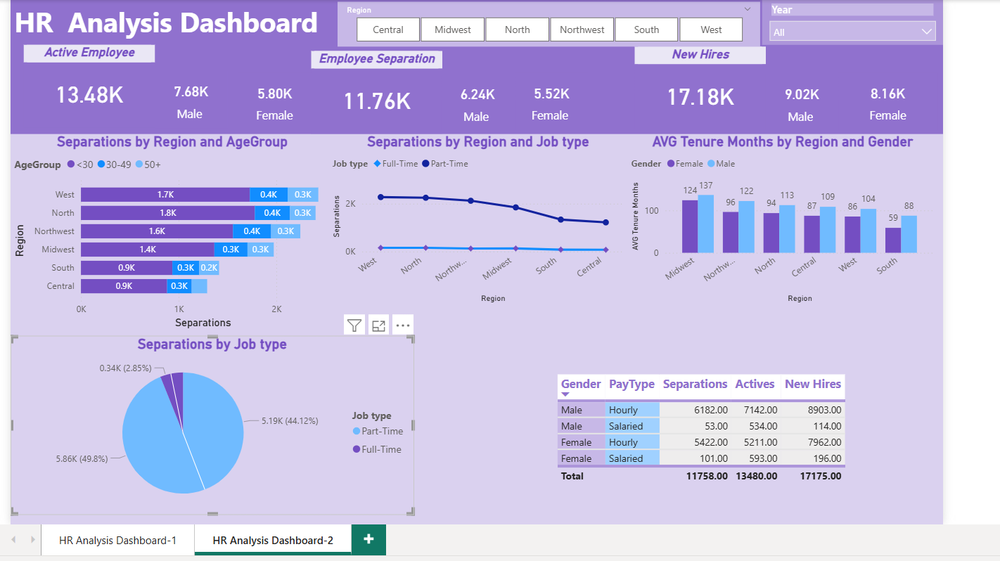

# Problem Statement
    Market fluctuations and rapid technological advancements have significantly impacted the global market. Numerous reports indicate that approximately half of employees are considering changing jobs. While many market analysts highlight flexible working arrangements and job security as the key factors, only a few employees cite higher salaries as their primary goal.
    Across various regions, salary trends have shown both increases and decreases over the years. Salary hikes were mainly intended to retain top-level professionals, while salary cuts were implemented due to market fluctuations but were reversed once market conditions improved. HR professionals worldwide are focused on recruiting new talent, retaining existing employees, and understanding the reasons behind employee separations.

# Tools
    Tools used for Data Cleaning, Data Analysis and Report generation:

    •	Excel
    •	PowerBI

# Workflow of this project:

    Here's a comprehensive outline for a HR Data Analytics Power BI Project including:
    - Exploratory Data Analysis (EDA)
    - Insights and Findings
    - Trends
    - Recommendations

# Exploratory Data Analysis

    EDA involved exploring the HR data to answer key questions, such as:
    •	What are the recruitment trends?
    •	What are New Hires, Retention and Separation trends?
    •	What are Male, and Female staff with age groups that have been retained over the years in every region?
    Actives by job time (part and full time), seperation by age-group type, region-type, job type  
    •	Loading and Cleaning Data: Import data into Power BI and use Power Query to clean and prepare it.
    •	Creating HR Metrics: Calculate essential HR metrics such as headcount, average leave balance, and average salary using  Power Pivot.
    •	Dashboard Design: Create a detailed monthly HR dashboard with Power BI.
    •	Using Card Visuals: Work with the "NEW" card visual to highlight specific metrics.
    •	The project addresses the following analysis themes:
    •	Active Employee Count Analysis: Determine how many people are employed in each region.
    •	Gender Breakdown: Analyze the gender distribution among the employess.
    •	Age Distribution: Examine the age spread of the employees.

# Data Cleaning
    In the initial data preparation phase, I performed the following tasks:

    •	Data loading and inspection
    •	Changing data types
    •	Optimizing the dataset by removing unnecessary and duplicate columns
    •	Standardizing abbreviations used in the dataset
    •	Handling missing values
    •	Data cleaning and formatting

# Data Modeling

    •	Managing Relationships between different tables.

# Dashboard Design and Creation

    With the processed data, I created a HR analytics dashboard that presents key insights on employee attrition. The dashboard includes charts showing attrition rates by age-group, job type, region ,salary providing a comprehensive view of factors contributing to attrition within the company. These visualizations can help inform HR decision-making and guide targeted efforts to reduce attrition and retain valuable employees by region and age group. I created two dashboard here for to make a compettative analysis: 

    The dashboard includes the following visualizations:
    •	Active Employee by Age group: Bar Chart.
    •	Active Employee by Region & Age Group: Column Chart.
    •	New Hires by Region & Job Type: Line Chart.
    •	Active Employee by Age group: Bar Chart.
    •	Seperation By Region & Age Group.

Power BI Dashboard-1

Power BI Dashboard-2

# Gained Insights

# 1. Employee Statistics
    Employee Statistics
    Total Number of Employees Over Time:
     •  Active employee 13.48 K
        • Male: 7.68 K employee
        • Female: 5.80 K employee
    •   Separation employee 11.76 K
        • Male: 6.24 K employee
        • Female: 5.52 K employee
    •   New Hire employee 17.18 K
        • Male: 9.02 K employee
        • Female: 8.16 K employee
   
# 2. Actives employee By Region and Job Type:
    Actives for Part-Time (8586.00) was higher than Full-Time (4894.00).  Part-Time accounted for 95.43% of Male New Hires. 
    Actives for Hourly and Salaried diverged the most when the AgeGroup was <30, when Hourly were 5319.00 higher than Salaried.

# 3. New Hires By Region and Job Type:
     Male New Hires and Female New Hires diverged the most when the Job type was Part-Time, when Male New Hires were 966.00 higher than Female New Hires. 
    Total New Hires was higher for Part-Time (16244.00) than Full-Time (931). 
    Average New Hires was higher for Part-Time (2,707.33) than Full-Time (155.17).

 # 4. Separation By Region and AgeGroup:
    Separations for Part-Time and Full-Time diverged the most when the Region was West, when Part-Time were 2120.00 higher than Full-Time.
    Male Separations and Female Separationss diverged the most when the Job type was Part-Time, when Male Separations were 668.00 higher than Female Separations.

    The Analysis results are summarized as follows:
    •	The company has over 13k employees, Male staff is around 57% and Female staff is 43%.
    •	Over the past few years, from 2011 till 2014, 11.76K employees have left jobs and noticeably Male staff is higher % as compared to Female staff members.
    •	The New Hires trend is upward every year with 17.18K new hires from 2011 till 2014.
    •	Age group of 30 and less are more compared to 30+ employees. Noticeably, new hires under the age of 30 are working as part-time jobs and in West and North regions.
    •	Employee retention is less in the West and North regions considering these regions have higher recruitment compared to all other regions.

# Recommendations
    Based on the analysis, I recommend the following actions:
    •	The company must focus on West and North regions for employee retention. Management can look into deploying some new measures, programs, perks or benefits for existing employees to ensure they will not leave the company.
    •	Implement a strategy to retain talented employees who will be an asset to a company.
    These insights highlight growth, gender imbalance, role distribution, salary disparities, and leave management within the organization.

 
