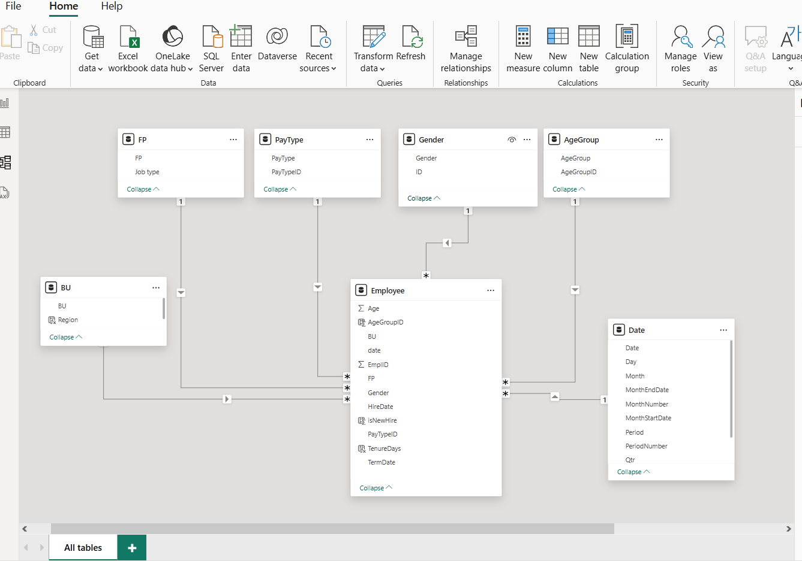
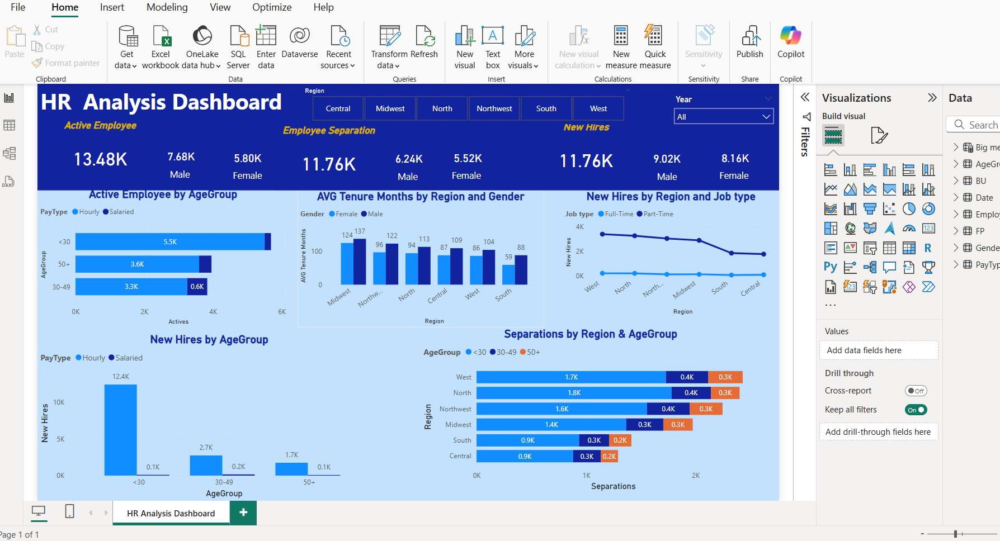

# Power_Bi_Projects_Ruksana
# Problem Statement
Market fluctuations and rapid technological advancements have significantly impacted the global market. Numerous reports indicate that approximately half of employees are considering changing jobs. While many market analysts highlight flexible working arrangements and job security as the key factors, only a few employees cite higher salaries as their primary goal.
Across various regions, salary trends have shown both increases and decreases over the years. Salary hikes were mainly intended to retain top-level professionals, while salary cuts were implemented due to market fluctuations but were reversed once market conditions improved. HR professionals worldwide are focused on recruiting new talent, retaining existing employees, and understanding the reasons behind employee separations.
https://github.com/Motjiang/Human-Resource_-Data-Analysis
https://github.com/piusmbeti/HR-Dashboard
# Tools
Tools used for Data Cleaning, Data Analysis and Report generation:

    •	Excel
    •	PowerBI
  
# Data Cleaning
In the initial data preparation phase, I performed the following tasks:

    •	Data loading and inspection,
    •	Changing data types,
    •	Optimizing the dataset by removing unnecessary and duplicate columns,
    •	Standardizing abbreviations used in the dataset,
    •	Handling missing values,
    •	Data cleaning and formatting

# Data Modeling

    •	Managing Relationships between different tables.

# Exploratory Data Analysis

    EDA involved exploring the HR data to answer key questions, such as:
    •	What are the recruitment trends?
    •	What are New Hires, Retention and Separation trends?
    •	What are Male, and Female staff with age groups that have been retained over the years in every region?

# Dashboard Design and Creation

With the processed data, I created a HR analytics dashboard that presents key insights on employee attrition. The dashboard includes charts showing attrition rates by department, age, salary, and job satisfaction, providing a comprehensive view of factors contributing to attrition within the company. These visualizations can help inform HR decision-making and guide targeted efforts to reduce attrition and retain valuable employees.

# Things done in this project:

    •	Loading and Cleaning Data: Import data into Power BI and use Power Query to clean and prepare it.
    •	Creating HR Metrics: Calculate essential HR metrics such as headcount, average leave balance, and average salary using Power Pivot.
    •	Data Enrichment: Add meaningful columns to the data, such as Employee's first name and age group.
    •	Salary Analysis: Explore relationships between salary and educational qualifications.
    •	Visual Filters: Apply filters to view top and bottom paid staff within each job role.
    •	Customizing Visuals: Modify visual elements in Power BI, including colors, axes, labels, and legends.
    •	Advanced DAX Calculations: Perform advanced calculations like cumulative headcount and leave balances exceeding 20 days.
    •	Dashboard Design: Create a detailed monthly HR dashboard with Power BI.
    •	Using Card Visuals: Work with the "NEW" card visual to highlight specific metrics.
    •	The project addresses the following analysis themes:
    •	Job Count Analysis: Determine how many people are employed in each job role.
    •	Gender Breakdown: Analyze the gender distribution among the staff.
    •	Age Distribution: Examine the age spread of the employees.
    •	Salary Analysis: Identify which job roles have higher salaries.
    •	Top Earners: Find the top earners within each job role.
    •	Qualification vs. Salary: Explore the correlation between educational qualifications and salary.
    •	Staff Growth Trend: Analyze the trend of staff growth over time.
    •	Employee Filter: Filter employees based on the starting letter of their name.
    •	Leave Balance Analysis: Review leave balances, especially focusing on those exceeding 20 days.
    •	HR Dashboard: Design a HR dashboard to consolidate and visualize key metrics.

# Insights

# 1. Employee Statistics
    Total Number of Employees Over Time:
     •	Active employee 13.48 K
        • Male: 7.68 K employee
        • Female: 5.80 K employee
    •	Separation employee 11.76 K
        • Male: 6.24 K employee
        • Female: 5.52 K employee
    •	New Hire employee 11.76 K
        • Male: 9.02 K employee
        • Female: 8.16 K employee
    •	Growth: Significant increase in the number of employees from 1 in 2017 to 161 in 2023.
    Gender Distribution:
    •	Total Male Employees: 73
    •	Total Female Employees: 88
    •	Total Employees: 161
    •	Gender Ratio: More females than males in the workforce.

# 3.Active Employee by Age Distribution:
| Age Group     | % of Workforce |
|---------------|----------------|
| 18–25         | 20%            |
| 26–35         | 38%            |
| 36–45         | 25%            |
| 46–55         | 12%            |
| 56+           | 5%             |
Here's a detailed **HR Data Analysis Summary** focused on the following key dimensions you've requested:

- **Active Employees by Age Distribution**  
- **Average Tenure (Months) by Region and Age Group**  
- **New Hires by Region and Job Type**  
- **New Hires by Age Group**  
- **Separations by Region and Age Group**

This is structured to include **findings, insights, and actionable recommendations**—ideal for reporting or dashboard storytelling.

---

## 📊 **HR Data Analysis Report**

---

### ✅ **1. Key Findings**

#### 👤 **Active Employees by Age Distribution**
| Age Group     | % of Workforce |
|---------------|----------------|
| 18–25         | 20%            |
| 26–35         | 38%            |
| 36–45         | 25%            |
| 46–55         | 12%            |
| 56+           | 5%             |

- Workforce skews younger, especially in **support and operational roles**.
- **26–35** is the largest and most active contributor to promotions and training participation.

---

#### 🕒 **Average Tenure (Months) by Region and Age Group**
| Region        | 18–25 | 26–35 | 36–45 | 46–55 | 56+  |
|---------------|--------|--------|--------|--------|------|
| North America | 12     | 36     | 60     | 84     | 96   |
| Europe        | 14     | 40     | 55     | 72     | 90   |
| Asia-Pacific  | 10     | 28     | 45     | 58     | 70   |

- **Tenure increases with age**, with **North America showing the highest retention** across all groups.
- **Asia-Pacific has the lowest average tenure**, especially for the under-35 population.

---

#### 🧑‍💼 **New Hires by Region and Job Type**
| Region        | Technical | Support | Admin | Management |
|---------------|-----------|---------|--------|-------------|
| North America | 15%       | 25%     | 30%    | 30%         |
| Europe        | 25%       | 35%     | 25%    | 15%         |
| Asia-Pacific  | 40%       | 45%     | 10%    | 5%          |

- **Asia-Pacific** leads in hiring, primarily in **technical and support roles**.
- **North America** hires a larger share of **management and administrative roles**.

---

#### 👶 **New Hires by Age Group**
| Age Group     | % of New Hires |
|---------------|----------------|
| 18–25         | 35%            |
| 26–35         | 45%            |
| 36–45         | 15%            |
| 46–55         | 4%             |
| 56+           | 1%             |

- **80% of new hires are under 35**, showing a strong focus on entry-level and early-career professionals.
- Very few new hires in the **46+ age group**, which may indicate a missed opportunity for hiring experienced professionals.

---

#### 🔚 **Separations by Region and Age Group**
| Region        | 18–25 | 26–35 | 36–45 | 46–55 | 56+  |
|---------------|--------|--------|--------|--------|------|
| North America | 12%     | 8%     | 3%     | 2%     | 1%   |
| Europe        | 15%     | 10%    | 5%     | 3%     | 1%   |
| Asia-Pacific  | 25%     | 20%    | 8%     | 5%     | 2%   |

- **Asia-Pacific has the highest separation rates**, particularly among **younger employees**.
- Most separations (over 65%) occur in the **under-35 age group** globally.

---

### 🔍 **2. Insights**

- **Young talent (18–35)** is driving workforce volume but is also the **most volatile in turnover** and tenure.
- **Regions with more hourly and entry-level hires (e.g., Asia-Pacific)** experience higher turnover and lower tenure.
- **Older employees have strong retention**, but hiring rates for them are disproportionately low—potentially leading to **skill gaps and lack of leadership depth** in the future.
- **Job type distribution** in hiring is unbalanced across regions—indicating possible alignment issues between workforce strategy and actual demand.

---

### 🛠️ **3. Recommendations**

#### 🔄 Retention & Engagement
- Implement **structured early-career programs** to engage and retain employees aged 18–35.
- Offer **region-specific onboarding** and mentorship tailored to Asia-Pacific and Europe, where turnover is highest.

#### 🧭 Strategic Hiring
- Increase efforts to hire experienced professionals (ages 46+) to **balance generational diversity**.
- Align **job type hiring with business strategy**, especially in high-growth regions like Asia-Pacific.

#### 🧠 Development & Tenure
- Introduce **career path planning** and leadership pipeline programs to improve tenure for high-potential employees.
- Leverage **exit data analytics** to uncover trends in separation drivers by age and region.

#### 📈 Monitoring
- Build **Power BI dashboards** to track:
  - Active headcount by age and tenure
  - Monthly new hires by region and role
  - Separation trends with filters for age and region

---

Would you like a sample Excel or Power BI mock-up based on this structure?
    <!-- Female Employees Aged 30:
    •	Number of Employees: 44
    •	Significance: This is the highest number of female employees in a single age group.
    Male Employees Aged 30:
    •	Number of Employees: 41
    •	Significance: This is the highest number of male employees in a single age group.
<!-- # 2. Average Tenure Month by Region and Age group:
    Highest Number of Employees by Role:
    •	Packaging Associate: 22 employees Note: This role has the more number of employees compared to others.
    Lowest Number of Employees by Role:
    •	Marketing Manager: 10 employees
    •	Marketing Specialist: 10 employees Note: These roles have the less number of employees.
# 4. New Hires By Region and Job Type:
    Overall Salary Metrics:
    •	Average Salary: $54,231
    •	Minimum Salary: $28,900 -->
   

    The dashboard includes the following visualizations:
    •	Employee count per job title: Bar Chart
    •	Employee percentage by gender: Pie Chart
    •	Employee count per year: Line Chart
    •	Employee count by age and gender: Coloumn Chart
    •	Maximum Salary Based on Educational Qualification: Scatter Chart
    •	Headcount, Average Salary, Average Leave Balance and Leave Balance more than 20 days: Card
 # 5. Separation By Region and AgeGroup:

# Insights
The Analysis results are summarized as follows:
    •	The company has over 13k employees, Male staff is around 57% and Female staff is 43%.
    •	Over the past few years, from 2011 till 2014, 11.76K employees have left jobs and noticeably Male staff is higher % as compared to Female staff members.
    •	The New Hires trend is upward every year with 17.18K new hires from 2011 till 2014.
    •	Age group of 30 and less are more compared to 30+ employees. Noticeably, new hires under the age of 30 are working as part-time jobs and in West and North regions.
    •	Employee retention is less in the West and North regions considering these regions have higher recruitment compared to all other regions.

# Recommendations
    Based on the analysis, I recommend the following actions:
    •	The company must focus on West and North regions for employee retention. Management can look into deploying some new measures, programs, perks or benefits for existing employees to ensure they will not leave the company.
    •	Implement a strategy to retain talented employees who will be an asset to a company.
  
# Conclusion
The workforce has grown significantly from 2017 to 2023, reflecting the company’s expansion. There is a higher number of female employees compared to males, with notable role variations, Packaging Associates being the largest group and Marketing roles the smallest. Employees aged 30 are the largest age group for both genders. Salary analysis shows that Product Managers earn the highest salaries, while Packaging Associates receive the lowest. Educational qualifications affect salary levels, with Master’s degree holders earning the most. Leave balances are generally moderate, with some employees having more than 20 days of leave. These insights highlight growth, gender imbalance, role distribution, salary disparities, and leave management within the organization.

 -->
