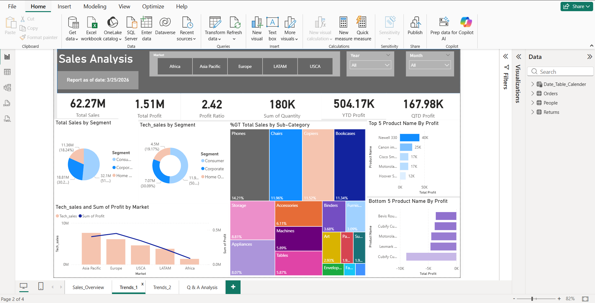
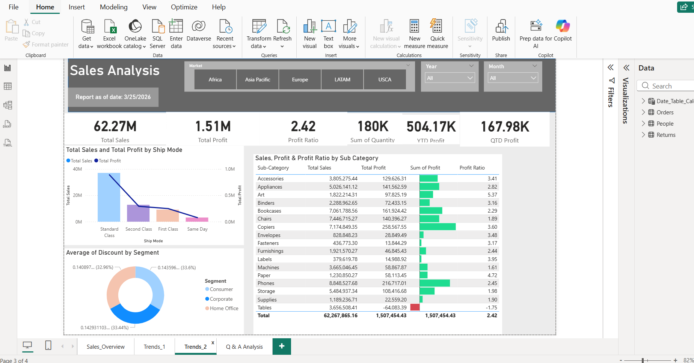

# Problem Statement
The central issue most analyses uncover is:
Profitability is inconsistent and often declining despite strong sales.

More specifically:

    * High sales ≠ high profit
    * Certain regions, categories, and discount strategies are eroding margins
    * Operational inefficiencies (shipping, returns, product mix) impact performance

# Project Overview
This project analyzes the Superstore Sales dataset using **Power BI**, focusing on key business metrics, trends, and actionable insights.

# Tools
Tools used for Data Cleaning, Data Analysis and Report generation:

    •   Excel
    •	PowerBI
        🔧 Tools & Visuals Used in Power BI:
        - Slicers for year, genre, type
        - Line and bar charts for trends
        - Treemaps for categorical data 
        - Custom tooltips for details on hover
        - KPI cards for summary statistics

# Workflow for Superstore Sales Data Analytics Project Using Power BI
Here's a comprehensive outline for a ** Superstore Sales Data Analytics Power BI Project** including:

    - Exploratory Data Analysis (EDA)
    - Insights and Findings
    - Trends
    - Recommendations
    - Conclusion

# Exploratory Data Analysis (EDA)

EDA in Power BI includes:  
    - Null/missing data checks (e.g., missing directors or cast data)
    - Data types formatting (duration into numeric values)
    - Date conversion for trends over time
    - Filters for Market, Year, Month

Initial Cleaning Tasks:
    - Split and normalize 
    - Create new fields:
    - Remove duplicates and null-heavy 

# Data Cleaning
Data Import: Importing CSV files into Power BI and connecting them to create a dataset for analysis
In the initial data preparation phase, I performed the following tasks:

    •	Data loading and inspection,
    •	Changing data types,
    •	Optimizing the dataset by removing unnecessary and duplicate columns,
    •	Standardizing abbreviations used in the dataset,
    •	Handling missing values,
    •	Data cleaning and formatting

# Data Modeling
Data Transformation: Using Power Query to clean and prepare the data. This involves removing unnecessary columns and ensuring proper data types for accurate analysis.
    •	Managing Relationships between different tables records.

  
# Dashboard Design and Creation

# Key Insights
- Total Sales: $62.27M | Total Profit: $1.51M | Profit Ratio: 2.42|Sum of Quantity: 180K|YTD Profit: 504.17K| QTD Profit: 167.98K
- Top Product by Profit: Newwell 330 ($618.21) which is under sub-category Art| Lowest: Bevis Round Tables 42 ($0.92)
- **Category Performance**: Technology  generates the highest revenue ($177,215.44), but Office Supplies has the best balance between revenue ($169,664.66)
-  and profit ($30,517.34).
- **Regional Performance**: Asia Pacific generates highest profit $23,706.49 and West Region has the least ($22,686.86).

#  Key Findings & Trends

 1. Sales vs Profit Disconnect

    * Some product categories (especially **Furniture**) generate **high revenue but low or negative profit**
    * **Technology** typically has the highest profit margins
    * Heavy discounting is a major driver of losses

👉 Insight: Revenue growth alone is misleading without margin control

---

2. Impact of Discounts

    * Strong negative correlation between **discount levels and profit**
    * Orders with discounts above ~20–30% often result in losses

👉 Insight: Aggressive discounting strategy is hurting profitability

---

 3. Regional Performance Variations

    * **West and East regions** tend to be more profitable
    * **Central region** often underperforms or generates losses

👉 Insight: Geographic strategy and cost structure are uneven

---

## 4. Category & Sub-Category Issues

Loss-making sub-categories commonly include:

        * Tables
        * Bookcases
        * Supplies
* High-performing sub-categories:

        * Copiers
        * Phones
        * Accessories

👉 Insight: Product portfolio has clear winners and losers

---

## 5. Customer Segment Behavior

    * Consumer segment* drives the most sales
    * *Corporate and Home Office* segments may be more profitable per order

👉 Insight: Not all customers contribute equally to profit

---

## 6. Shipping & Operational Costs

    * Faster shipping modes (e.g., Same Day) significantly increase costs
    * Longer shipping times may reduce customer satisfaction but improve margins

👉 Insight: Trade-off between cost efficiency and service level

---

#  Recommendations

## 1. Optimize Discount Strategy

    * Set stricter discount thresholds (e.g., avoid >20% unless justified)
    * Use targeted discounts instead of blanket promotions
    * Analyze discount effectiveness by category and region

---

## 2. Rationalize Product Portfolio

    * Reduce or redesign loss-making sub-categories (e.g., Tables)
    * Focus on high-margin products (Technology segment)
    * Negotiate better supplier costs for low-margin items

---

## 3. Regional Strategy Adjustment

    * Investigate why Central region underperforms:
    * Higher shipping costs?
    * Pricing issues?
    * Customer mix?
    * Replicate best practices from profitable regions

---

## 4. Improve Customer Segmentation

    * Target high-profit customer segments with loyalty programs
    * Personalize offers instead of broad discounts

---

## 5. Optimize Shipping Policies

    * Encourage standard shipping with incentives
    * Charge appropriately for expedited shipping
    * Optimize logistics and warehouse placement

---

## 6. Data-Driven Decision Making

Implement dashboards to track:

    * Profit by category
    * Discount impact
    * Regional performance
* Use predictive analytics to forecast profitable growth

---

# Executive Summary:
 This report presents a comprehensive analysis of key findings derived from our business data. 
By examining payment modes, regions, customer segments, sales performance, profitability, shipping modes, 
product categories, sales forecast, and state-wise sales, we have gained valuable insights that can guide
our business decisions and strategies. These findings shed light on customer preferences, market dynamics,
and areas of opportunity. By leveraging these insights, we can optimize our operations, drive sales growth,
 and enhance profitability.

Segment Analysis:
    The Consumer segment was the top contributor to sales, accounting for 51.5% of the total sum 32.1 M. To capitalize on this segment's potential, we should implement personalized marketing campaigns, loyalty programs, and customer retention initiatives. 

Sales Analysis:
    Sales in 2020 surpassed those in 2019, indicating positive growth. December was a critical month, contributing 10.61% of the total sum of sales in 2020. 

Profit Analysis:
    Total Profit trended up, resulting in a 84.04% increase between 2012 and 2015. 
        
Shipping Mode Analysis:
    Standard Class was the most preferred shipping mode (58.27%, 37M sales).

Category Analysis:
    Technology topped product categories, followed by Furniture and Office Supplies (41.11%). 

Market Wise Sales Analysis:
    Regionally, Europe generated the highest profit (449K), while Asia Pacific led in sales (20.2M, 30.92%).
    
# Conclusion:
The findings presented in this report provide valuable insights into various aspects of our business. By analyzing payment modes, regions, customer segments, sales performance, profitability, shipping modes, product categories and state-wise sales, we can make informed decisions and formulate strategies to optimize operations, drive growth, and enhance profitability. It is crucial to continue monitoring these metrics, conduct further analysis, and adapt our strategies based on evolving customer preferences and market dynamics. By leveraging these insights effectively, we can stay ahead of the competition and deliver exceptional value to our customer.

 

